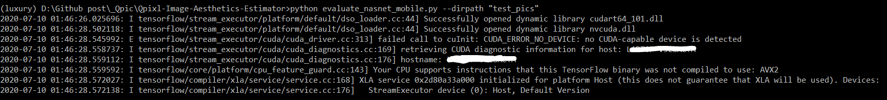
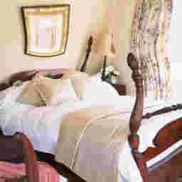
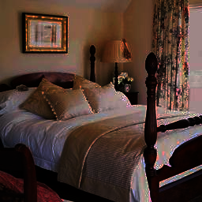

# Qpixl-Image-Quality-Inspector
In this project, I have implemented a deep-neural-network based image quality estimator. The implementation has been based on the ideas presented in [NIMA: Neural Image Assessment](https://arxiv.org/abs/1709.05424).

## About NIMA
The technique presented in the NIMA paper assigns a Mean + Standard Deviation score to the images based on the quality of images. The score can be used as a metric to compare quality of different images or as a baseline estimate to rate images.

## Implementation Details

### Dataset
I have used the AVA Dataset for training my model. The [AVA dataset](http://academictorrents.com/details/71631f83b11d3d79d8f84efe0a7e12f0ac001460) contains around *255,000 images* and the counts of aesthetics ratings on a scale of 1-10 for every image. *250,000 images* were used for training and *5000 images* were used for validation.

### Model Architecture and Transfer Learning
I have used the NASNet Mobile network as the base model for training. The weights of the layers of the base model have been freezed and top layers have been trained (Tranfer Learning).

### Loss Function
The Earth Mover Distance (EMD) loss function has been used as presented in the NIMA paper.

## Results
After the training was complete, I achieved a EMD loss of `~0.072` on the validation set.

## Usage details

### Training
First run the `check_dataset.py` file to check for corrupted files in the dataset. Remove these files from the dataset

Pre-trained weight are available in the `weights` folder. To train or tweak the model yourself, refer to `train_nasnet_mobile.py` file.

### Evaluation
The evaluation on a new set of images can be done using a **command line argument parser** created in the `evaluate_nasnet_mobile.py` file.


Parser arguments:
```
-- dirpath: Pass the relative/full path of a directory containing a set of images. Only png, jpg and jpeg images will be scored.

-- imgpaths : Pass one or more relative/full paths of images separated by clank space to score them. Only png, jpg and jpeg images will be scored.

-- rank : Flag to specify if the images are to be ranked in order of their quality in the result file
```
> Use -h argument to view parser argument usage details in the command line

Example
<p align="center">
  
</p>

The results will be stored in the `record.txt` file. For every image, a mean aesthetic score and the standard deviation will be written into the file.

## Image example

Results are presented below for the same image by adding blurring, noise, distortions, etc.

<div style="clear:right">
  
  <br>
  <span style="font-size:1.2em;margin-right:10px;font-weight:bold">SCORE:</span>
  <span style="font-size:1.2em;">5.27 +-(1.49)</span>
</div>

<br>

<div style="clear:right">
  
  <br>
  <span style="font-size:1.2em;margin-right:10px;font-weight:bold">SCORE:</span>
  <span style="font-size:1.2em;">4.99 +- (1.51)</span>
</div>

<br>

<div style="clear:right">
  
  <br>
  <span style="font-size:1.2em;margin-right:10px;font-weight:bold">SCORE:</span>
  <span style="font-size:1.2em;">5.39 +- (1.50) </span>
</div>

<br>

<div style="clear:right">
  
  <br>
  <span style="font-size:1.2em;margin-right:10px;font-weight:bold">SCORE:</span>
  <span style="font-size:1.2em;">5.09 +- (1.44)</span>
</div>

<br>

<div style="clear:right">
  
  <br>
  <span style="font-size:1.2em;margin-right:10px;font-weight:bold">SCORE:</span>
  <span style="font-size:1.2em;">4.78 +- (1.54)
</span>
</div>
